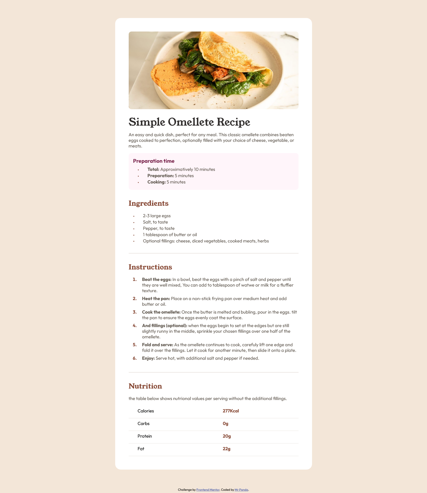

# Frontend Mentor - Recipe page solution

This is a solution to the [Recipe page challenge on Frontend Mentor](https://www.frontendmentor.io/challenges/recipe-page-KiTsR8QQKm). Frontend Mentor challenges help you improve your coding skills by building realistic projects. 

## Table of contents

  - [Screenshot](#screenshot)
  - [Links](#links)
  - [My process](#my-process)
  - [Built with](#built-with)
  - [What I learned](#what-i-learned)
  - [Author](#author)

**Note: Delete this note and update the table of contents based on what sections you keep.**

### Screenshot




### Links

- Solution URL: [Add solution URL here](https://www.frontendmentor.io/solutions/recipe-page-using-html-and-css-01BoTYIN1c)
- Live Site URL: [Add live site URL here](https://recipe-page-five-lime.vercel.app/)

### Built with

- Semantic HTML5 markup
- CSS custom properties
- Flexbox

**Note: These are just examples. Delete this note and replace the list above with your own choices**

### What I learned

I learned how to create a custom bullet point in css.


```css
.proud-of-this-css::before {
    content: '•'; 
    margin-right: 30px; 
    font-size: 16px; 
    color: var(--headings-color);
    vertical-align: middle; 
}
```

## Author
- Frontend Mentor - [@yourusername](https://www.frontendmentor.io/profile/Mr-Panda1)